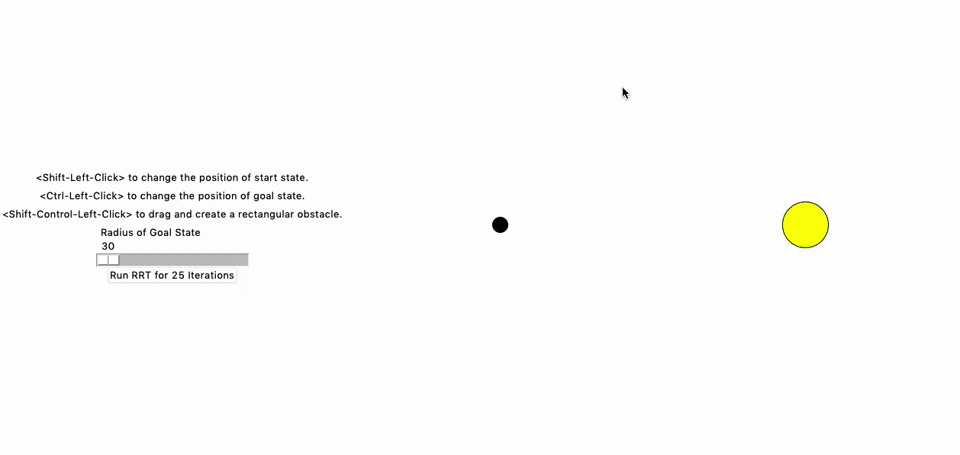

# RRT-Star

An Implementation of RRT* from ["Incremental Sampling-based Algorithms for Optimal Motion Planning" by Karaman et al. 2010](https://arxiv.org/pdf/1005.0416.pdf).



## Inspiration

A similar demonstration is shown in this [robotics lecture from the University
of Houston](https://www.youtube.com/watch?v=Ob3BIJkQJEw), and is also hosted on
[Wolfram](http://demonstrations.wolfram.com/RapidlyExploringRandomTreeRRTAndRRT/).

## Usage

Dependent on [`tkinter`](https://docs.python.org/3/library/tkinter.html) for GUI
capabilities, and [`numpy`](https://www.numpy.org/) for computations.

```bash
python3 rrtstar.py
```

## Desired Features

- [x] Allow movement of start and goal state
- [x] Change radius of goal state
- [x] Add rectangular obstacles
- [ ] Show total number of iterations passed
- [ ] Show cost of shortest path to goal state
- [ ] Allow ability to clear obstacles
- [ ] Add exploration bias
- [ ] Update shortest path if goal state is moved
- [ ] Add restart button
